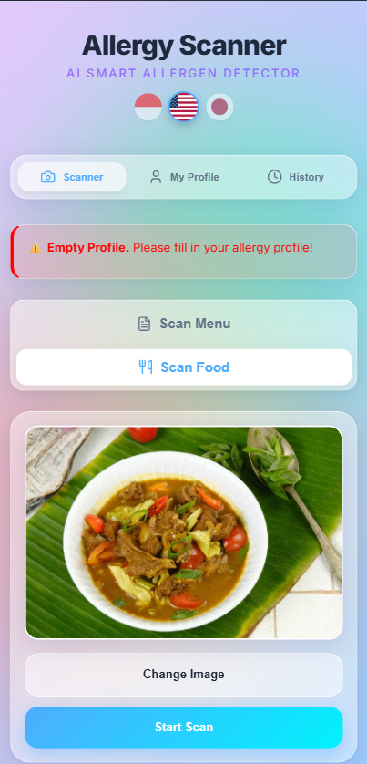
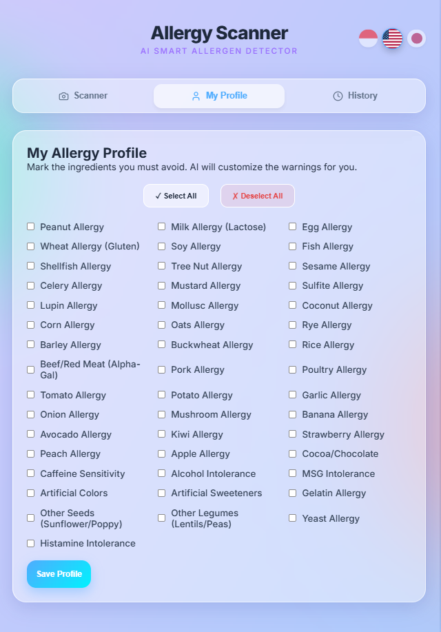
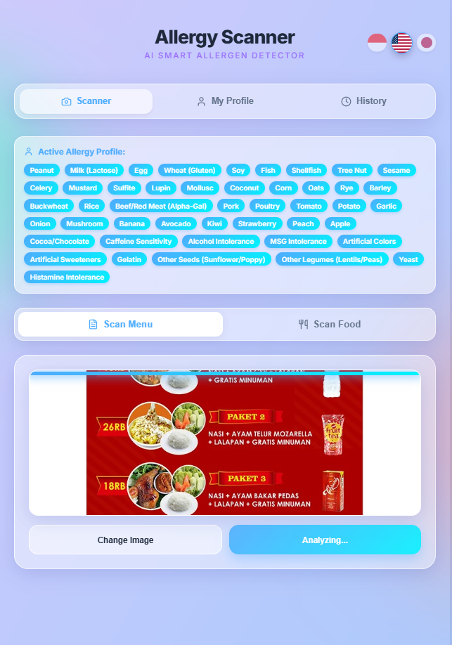
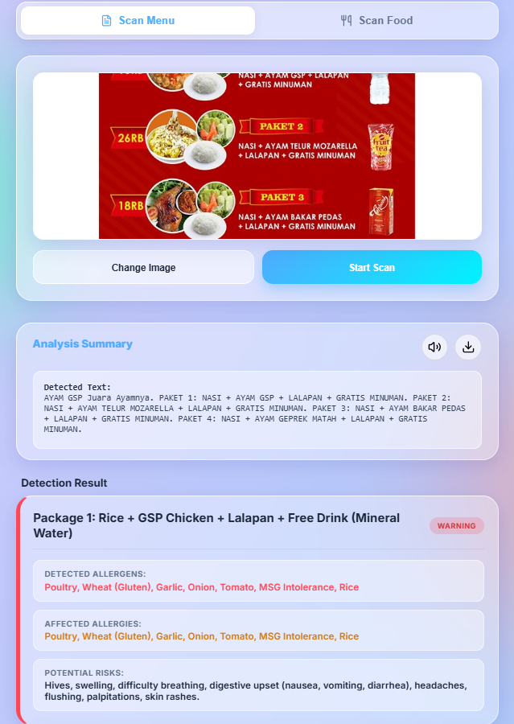
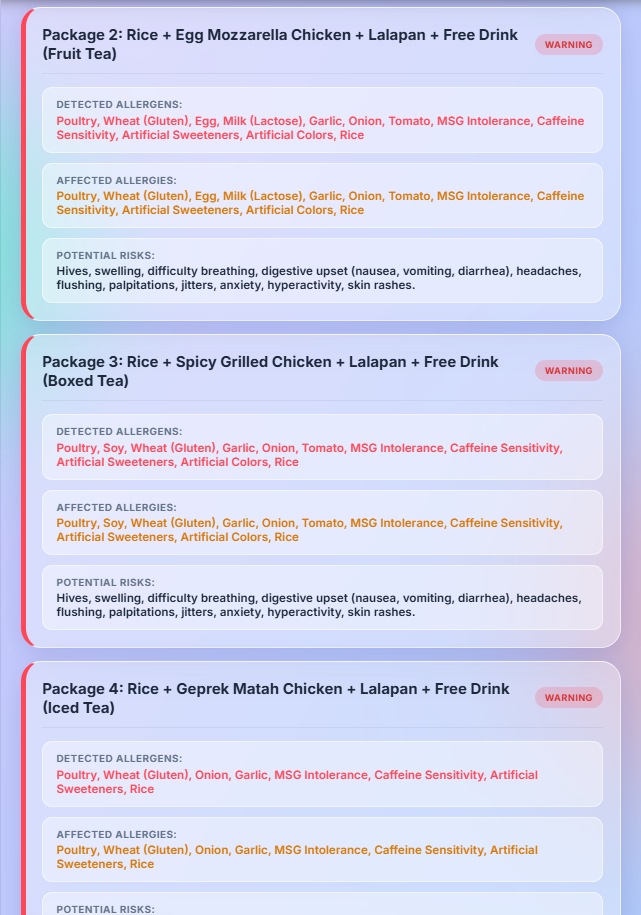
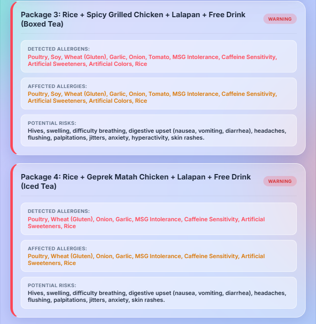
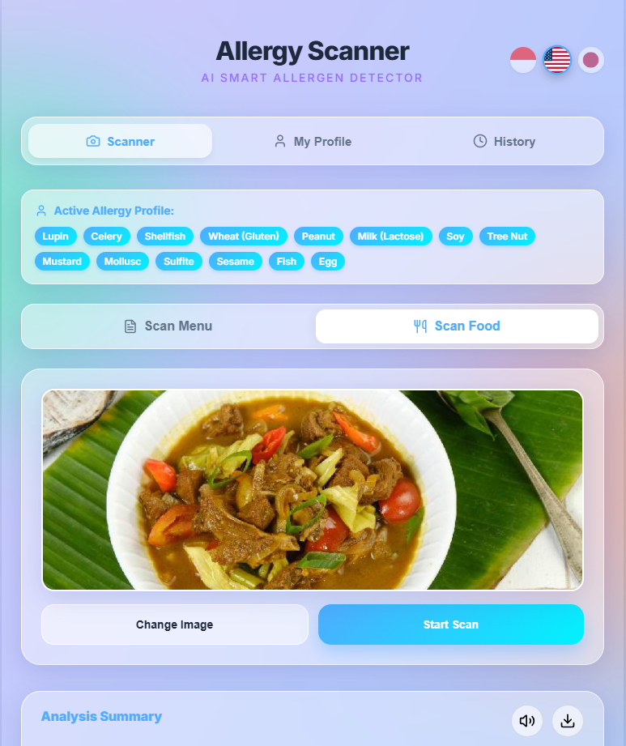
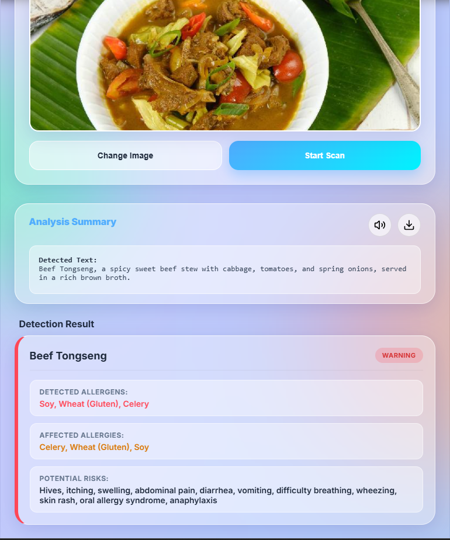
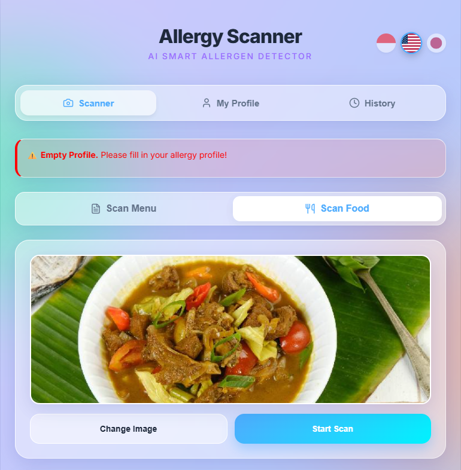
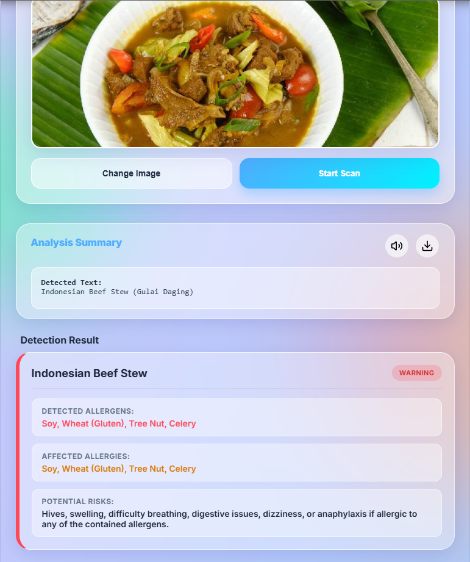

# 🍽️ Food Allergy Scanner (AI Smart Allergen Detector)

**Food Allergy Scanner** is an intelligent Artificial Intelligence (AI) powered application designed to help users detect potential allergens in restaurant menus or actual food photos. By simply uploading a photo, the AI analyzes the food composition and cross-references it with the user's personal allergy profile to provide early warnings.

---

## ✨ Key Features

- 📸 **AI-Powered Scanning (Gemini Vision):** Automated analysis of restaurant menu text or direct food photography.
- 👤 **Personalized Allergy Profile:** Users can select from an extensive list of 46+ allergens and intolerances (e.g., Peanuts, Dairy, Alpha-Gal, Caffeine, MSG, Histamine). The system matches the detection results against this profile.
- 🌍 **Multi-language Support:** The interface seamlessly supports English, Indonesian, and Japanese.
- 💎 **Modern Design (Glassmorphism):** Beautiful transparent glass UI with interactive and elegant pop-up alerts (SweetAlert2).
- 🔊 **Voice Alerts (Text-to-Speech):** The system can read analysis results and warnings out loud.
- 📄 **PDF Export:** Save or share the allergen scan results in a structured PDF document.
- 🕒 **Scan History:** Keep track of the food and menus you have scanned previously.

---

## 🛠️ Tech Stack

### Frontend (User Interface)
- **React.js (Vite)**
- **Vanilla CSS (Glassmorphism UI)**
- **SweetAlert2** (For elegant modals and pop-ups)
- **Lucide React** (Icons)
- **html2canvas & jsPDF** (For the PDF export feature)

### Backend (Server & Logic)
- **Java Spring Boot**
- **Google Gemini API** (`gemini-2.5-flash` model for both text and image processing)
- **Spring Data JPA & H2 Database** (For storing user profiles and scan histories)

---

## 🚀 How to Run Locally

### Prerequisites
- **Node.js** (v16 or newer)
- **Java Development Kit (JDK)** (v17)
- **Google Gemini API Key**

### 1. Clone the Repository
```bash
git clone https://github.com/your-username/food-allergy-scanner.git
cd food-allergy-scanner
```

### 2. Setup the Backend (Spring Boot)
1. Open the `backend` folder.
2. Open the `src/main/resources/application.properties` file.
3. Insert your Gemini API Key:
   ```ini
   gemini.api.key=YOUR_API_KEY_HERE
   ```
4. Run the application using Maven:
   ```bash
   ./mvnw spring-boot:run
   ```
   *The backend will run on `http://localhost:8080`*

### 3. Setup the Frontend (React/Vite)
1. Open a new terminal and navigate to the `frontend` folder.
2. Install the dependencies:
   ```bash
   npm install
   ```
3. Start the development server:
   ```bash
   npm run dev
   ```
   *The frontend will run on `http://localhost:5173`*

---

## 💡 How to Use

1. Open the application in your browser.
2. Navigate to the **👤 My Profile** tab, check the allergens you want to avoid, and click **Save Profile**.
3. Return to the **📷 Scanner** tab.
4. Select a mode: **Scan Menu** (for text/lists) or **Scan Food** (for a picture of the dish itself).
5. Click the camera icon or the **Gallery** button to upload an image.
6. Click **Start Scan**.
7. The AI will process the image and provide a result card:
   - 🟢 **Safe:** If no allergens match your profile.
   - 🔴 **Warning:** If the food is detected to contain ingredients dangerous to you.
8. Click the 🔊 button to listen to the results, or the 📥 button to download a PDF version.

---

## 📝 Important Note
This application is an AI-powered detection assistant and **cannot replace professional medical advice**. Always verify directly with restaurant staff or food manufacturers if you have a life-threatening allergy (anaphylaxis).

---

*Built as a modern web development portfolio project.*

---

## 📸 Application Interface

### 📱 Mobile Responsive View
*The application interface perfectly adapts to mobile screens.*



### ⚙️ Profile Setup
*Users can select from 46+ different types of allergies and intolerances.*



### 📄 Scan Menu Feature
*Extracts text from restaurant menus and detects hidden allergens in the dishes.*









### 🛡️ Scan Food Results (With Active Profile)
*Personalized warnings based on user's specific allergies.*





### ⚠️ Scan Food Results (Empty Profile / General Warning)
*General allergen alerts when the user has not set up an allergy profile.*




